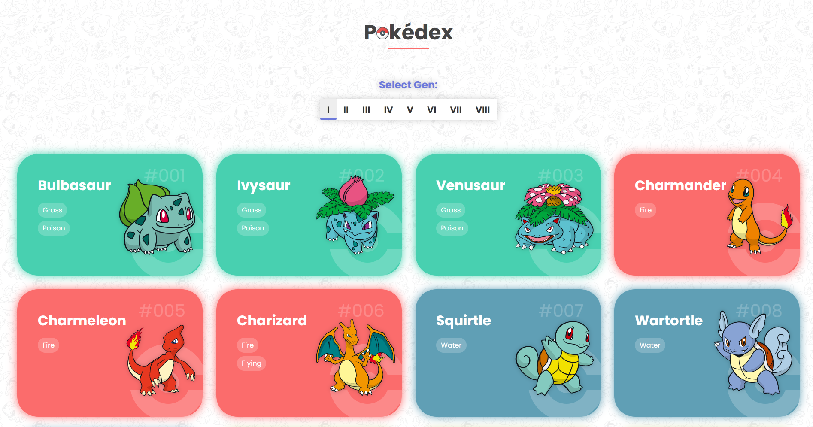
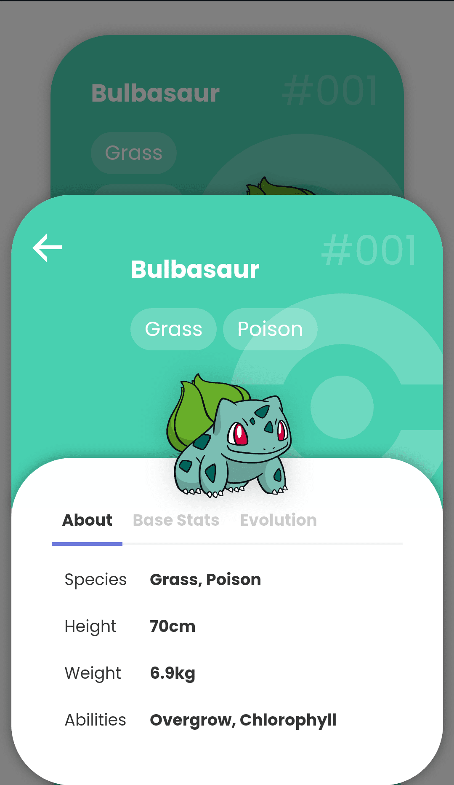
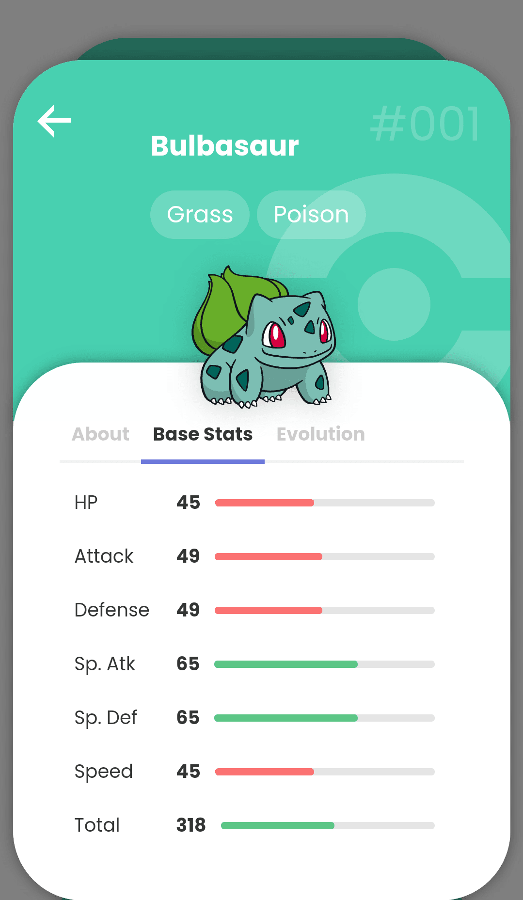
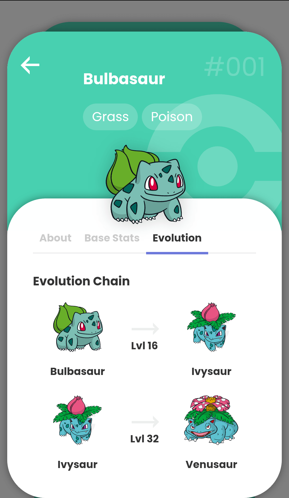
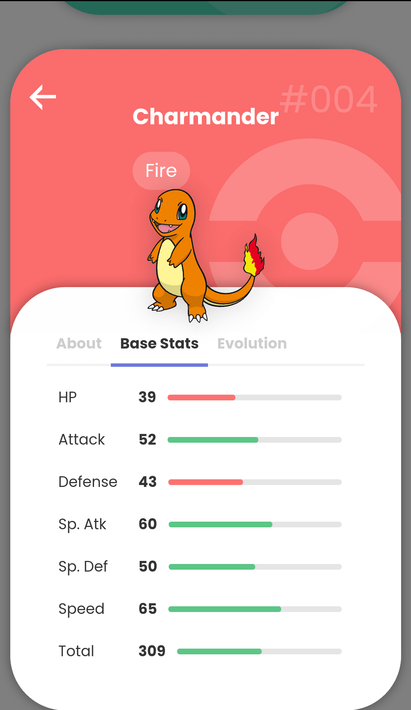
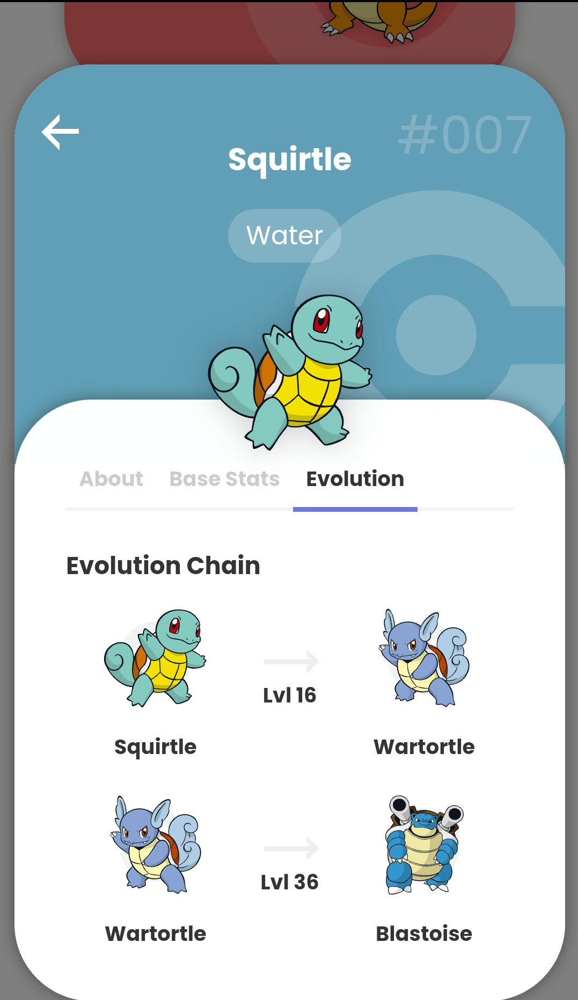
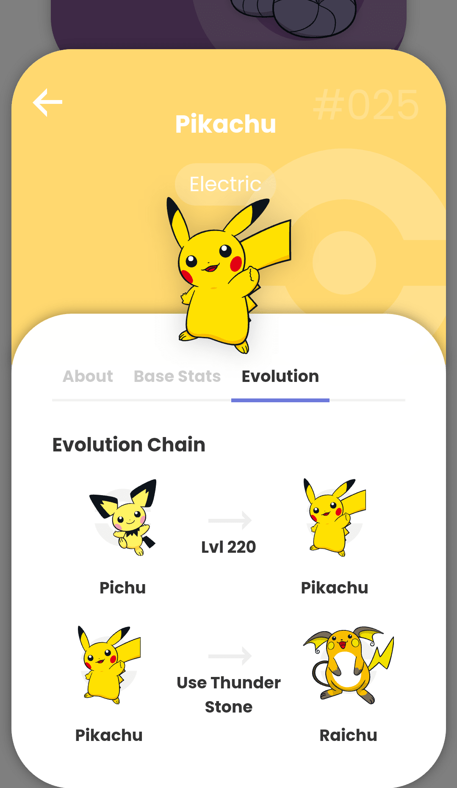

# React Pokedex

A Pokedex application created using [PokeAPI](https://pokeapi.co/docs/v2)




| <!--                                --> | <!--                                --> | <!--                                --> |
|-----------------------------------------|-----------------------------------------|-----------------------------------------|
|  |  |  |
|  |  |  |

## Installation

Before running the application, make sure you have Node.js and npm (or yarn) installed on your machine.

1. Clone this repository to your local machine:

```bash
git clone https://github.com/kthom123/react-pokedex.git
```

2. Navigate into the project directory:

```bash
cd react-pokedex
```

3. Install the dependencies:

Using npm:

```bash
npm install
```

Or using yarn:

```bash
yarn
```

## Usage

To start the development server and run the application:

Using npm:

```bash
npm start
```

Or using yarn:

```bash
yarn start
```

This will open the app in your default web browser at `http://localhost:3000`.

## Building for Production

To build the application for production:

Using npm:

```bash
npm run build
```

Or using yarn:

```bash
yarn build
```

This will create a `build` directory with optimized production-ready assets.
